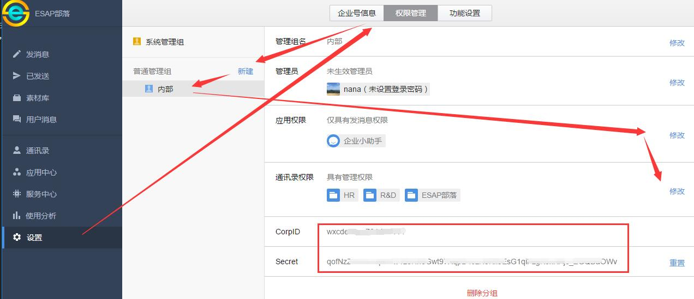

# 快速开始

* [申请微信企业号](#申请微信企业号)
* [设置管理权限](#设置管理权限)
* [导入模板](#导入模板)
* [启动API](#启动API)
* [关于EncodingAesKey](#关于EncodingAesKey)
* [开启调试模式](#开启调试模式)

## 申请微信企业号
* 首先到微信公众平台申请企业号：[https://mp.weixin.qq.com/](https://mp.weixin.qq.com/)

## 设置管理权限
* 登陆你申请好的企业号，进入【设置】--【权限管理】--【新建普通管理组】

* 接下来对该管理组设置：【设置管理员】

* 接下来对该管理组设置：【设置应用权限】-【勾选企业小助手】

* 同时设置【通讯录权限】-【勾选所有成员的管理权】

* 记录下 **【CorpID】** 和 **【Secret】** ，这两个参数在后面会用到。



## 下载ESAP服务器文件包
* 从项目首页：[https://erp8.net/esap/](./README.md)下载最新的服务器文件包，可选择x86或x64版本。

## 导入模板
* 解压下载的文件包，将其中`【微信提醒】`模板导入你的ES应用中。

> 注意，模板导入到非9.4.124版本时可能会提示导入公式或工作流出错，这个是正常的，请无视。

## 启动API
* 双击esap.exe启动即可,首次启动后会自动进入配置界面，默认是:[localhost:9090/conf](https://localhost:9090/conf)


## 关于EncodingAesKey
可以从企业号进入`【企业小助手】`，设置回调模式的界面获取。


## 开启调试模式

* 配置文件EsConf看起来是这样：

```json
{
 "Token": "你的企业号应用回调token，例如：esap",
 "EncodingAesKey": "你的企业号应用回调EncodingAesKey",
 "CorpId": "你的企业号CorpId", 
 "Secret": "你的管理组Secret",
 // ESAP服务端口
 "Port": "9090",
 // 微信提醒标题
 "WxtxTitle": "【ESAP提醒】",
 // 提醒扫描间隔(分钟)，填0则不扫描
 "WxtxDuration": 1,
 // 邮件扫描间隔(分钟)，填0则不扫描
 "MailDuration": 2,
 "NeedWxOAuth2": false,
 // ESAP外网IP(域名)
 "Host": "www.erp8.net",
 // ESweb外网页面
 "Esweb": "http://www.erp8.net:9999/esweb",
 // 数据库服务器，本机可以只填个.，支持自定义实例端口，示例：192.168.1.10/实例名,端口
 "Server": "192.168.99.20",
 // 数据库用户名
 "UserId": "sa",
 // 数据库密码
 "Pwd": "123",
 // ES应用数据库，可以改成esapp1
 "DbName": "esap",
 // 修改为true重启ESAP即可打印调试信息
 "Debug": true
}
```

> 注意，最好用Notepad++或者sublime等文本编辑器，不要用windows的记事本编辑，可能会导致无法读取配置
