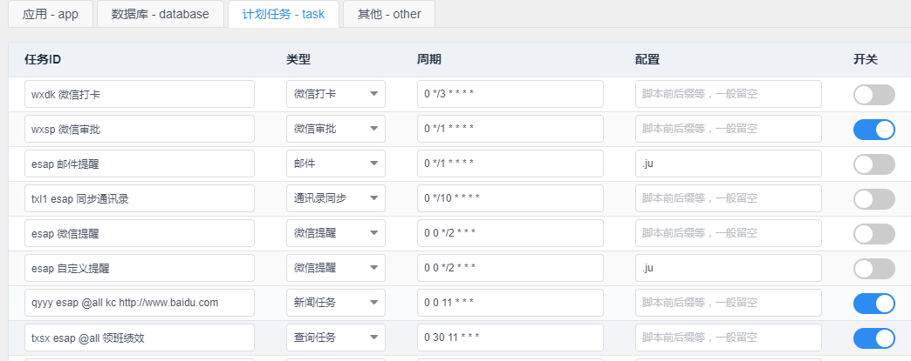

# 计划任务
* 目前主要包括3种【用户任务】：

 1. 查询任务`QueryTask`（select）
 2. 新闻任务`QueryNewsTask`（select）
 3. 执行任务`ExecTask`（update/insert/delete）

* 和5种【系统任务】：微信提醒，esmail，通讯录同步，审批同步，打卡同步：

## 用户任务配置
* 首先，建立一个sql/esap/XXX.get文件(可复制修改task.get)，编辑需要执行的sql模板


```sql
----查询任务QueryTask，四段(app db user title)
{{define "qyyy esap @all kc"}}
	select 品 as 品号,名 as 品名,isnull(数,0)as 库存 from vlbq where 1=1
{{end}}

----新闻任务QueryNewsTask，五段(app db user title url)
{{define "qyyy esap @all kc www.baidu.com"}}
	select 品 as 品号,名 as 品名,isnull(数,0)as 库存 from vlbq where 1=1
{{end}}

----执行任务ExecTask，两段(db，唯一标识)
{{define "task wxtx"}}
	update wxtx set flag=1
	update wxtx set jg='ok'
{{end}}
```


* 然后，到配置中新增并开启这些计划，选择类型，编辑周期(express)，保存重启即可。



## 周期(Express)表达式
表达式一共6段，每段的意义和取值如下：

|字段|允许值|特殊字符值|
|:----|:--:|:--:|
|秒|0-59|, - * /|
|分|0-59|, - * /|
|时|0-23|, - * /|
|日|1-31|, - * /|
|月|1-12|, - * /|
|周|0-7|, - * /|

|特殊字符值|意义|
|:----:|:--|
|*   | 表示所有值|
|-   | 表示一个指定的范围|
|,   | 表示附加一个并列值|
|/   | 符号前表示开始时间，符号后表示每次递增的值|

|示例表达式|意义|
|:----|:--|
|`0 0 12 * * *` |   每天中午12点触发|
|`0 15 10 * * *` |   每天上午10:15触发|
|`0 * 14 * * *` |   在每天下午2点到下午2:59期间的每1分钟触发|
|`0 */5 14 * * *` |   在每天下午2点到下午2:55期间的每5分钟触发|
|`0 */5 14,18 * * *` |   在每天下午2点到2:55期间和下午6点到6:55期间的每5分钟触发|
|`0 0-5 14 * * *` |   在每天下午2点到下午2:05期间的每1分钟触发|
|`0 10,44 14 * 3 3` |   每年三月的星期三的下午2:10和2:44触发|
|`0 15 10 * * 1-5` |   周一至周五的上午10:15触发|
|`0 15 10 15 * *` |   每月15日上午10:15触发|
