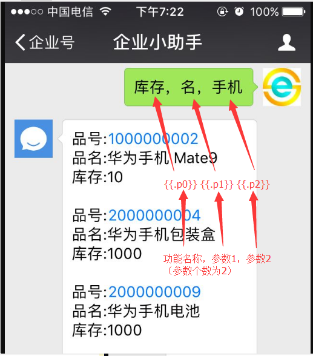

# 微信超级查询
* ESAP可快速对接微信公众号/企业号回调接口，自定义SQL语句，自定义权限，实现引擎式超级查询。
* 依赖`微信查询` 模板。
* 需开启微信公众号/企业号的回调模式，回调URL示例：
 - 企业号(企业微信)：ESAP服务器IP:9090/wx
 - 服务号(订阅号)：ESAP服务器IP:9090/wxs

## 微信查询原理
* 系统根据用户输入的第一个关键字（例如下图的`库存`），扫描wxcx表中对应的sql，执行并返回结果。
* 其他关键字被视为查询参数（例如下图中的`名`,`手机`），sql中可以使用`:p1,:p2`替换where条件。
```
select 品号,名 as 品名,库存 from 库存表 where { {.p1} } like '%'+:p2+'%'
```


**微信查询使用的必要前提是会sql，请自行学习！**

- [新版特性](#新版特性)
 - [进入提示](#进入提示) <span style="color:red">new!</span>
 - [多重查询](#多重查询) <span style="color:red">new!</span>
 - [文章返回](#文章返回) <span style="color:red">new!</span>
 - [UUID](#UUID)
- [动态模板](#动态模板)
 - [参数解释](#参数解释)
- [多重权限](#多重权限)
- [企业号通讯录变量](#企业号通讯录变量)
- [语音查询](#语音查询)
- [扫码查询](#扫码查询)
- [图片附件查询](#图片附件查询)
- [回写数据](#回写数据)
- [默认应用](#默认应用) 
- [微信填报](#微信填报)
- [菜单填报](#菜单填报)
- [表单查询](#表单查询)
- [待办列表打开](#待办列表打开)
- [*数据字典](#数据字典)

#### 新版特性 (2.8+)

##### 进入提示
* esap配置showfunclistenter=true

* 企业号应用配置用户进入提醒

* qCmts写select来作为进入提醒。


 
##### 多重查询
* 可以写多个select语句，这些语句结果都能返回。


 
##### 文章返回
* url有值时触发。


##### UUID
* \{\{uuid\}\} 对应一个全球唯一的id, 可用于构建自动编号。

#### 动态模板
* 2.6+支持模板语法，动态参数和动态sql

**[点击这里参考更多用法](https://app.esap.vip/admin#/wxcx)**


##### 参数解释

* 用户的输入(逗号或句号分隔)会被esap解析为p0,p1,p2...pn,以及一个特别的P(大写)代表输入的所有内容

例如用户输入：`库存，手机，一号仓` 会被解析为可用参数：`p0=库存，p1=手机，p2=一号仓,P=库存，手机，一号仓`

* 在sql中使用{ {.pn} }作参数替换，如果跟在等于号（=）后面作为值替换，可以直接使用:pn。

例如： `select 姓名,工号 from { {.p0} } where 姓名=:p1`

* 要注意的是`{ {.pn} }`用在文本型值位置应该加上单引号，以免被sql误认为是字段，而`:pn`形式则不需要。

所以上面的语句等价于： `select 姓名,工号 from { {.p0} } where 姓名='{ {.p1} }'`

#### 多重权限
用逗号隔开，可用姓名，账号，部门随意组合。

#### 企业号通讯录变量
* \{\{姓名\}\} 对应 `姓名`
* \{\{账号\}\} 对应 `账号`
* \{\{部门\}\} 对应 `部门`
* \{\{职位\}\} 对应 `职位`
* \{\{性别\}\} 对应 `性别`
* \{\{手机\}\} 对应 `手机号`
* \{\{邮箱\}\} 对应 `邮箱`

#### 语音查询


#### 扫码查询
二维码或其他条码等,wxcx表中的mkey与自定义菜单的扫码弹框菜单key对应即可


#### 图片附件查询
sql结果字段或别名为`pic`或`图片`，`files`或`附件`

* 支持sql返回多个`图片`或`附件`


> 注意微信限制：图片一般不能超过2M,附件不超过20M

#### 回写数据
isUpdate=1，sql中使用update或insert


> 2.5+

#### 默认应用
* 查询名称(qName)为应用ID（agentId），查询不再需要关键字引导，仅需输入参数就可查询。


* 或直接扫二维码秒查。


> 2.7+，注意新增的应用，管理组要配置相应权限。

#### 微信填报
isUpdate=2，sql字段填模板名称


> 2.5+，其他配置同[微信办理](./s3.md#微信办理)

2.8+新增db字段，可多帐套填报。

#### 菜单填报
设置mkey，与企业号应用自定义菜单中的key一致。


> 2.5+，其他配置同[微信办理](./s3.md#微信办理)

#### 表单查询
isUpdate=3，sql返回的第二个值为rcid


> 2.6+，其他配置同[微信办理](./s3.md#微信办理)

2.8+新增db字段，可多帐套查询。

#### 待办列表打开
设置一个自定义菜单，key为`dbsy`


* 建议修改Esweb\main\todoViews.aspx，head下增加一个<meta>标签，以便适应移动访问，内容如下：

```
<meta name="viewport" content="width=device-width,initial-scale=1">
```

> 2.6+，其他配置同[微信办理](./s3.md#微信办理)

## 数据字典
微信查询主要扫描`wxcx`表，对应字段解析如下：

|字段|描述|必填|备注|
|:----:|:--:|:--:|:----|
|mKey|微信自定义菜单id|否|绑定菜单id|
|qName|查询名称|否|绑定查询第一个关键字；也可以绑定一个agentId|
|qCmts|查询提醒|否|可以是一个select语句|
|sqlStr|sql模板|是||
|uid|用户权限|是|@all代表全体可用|
|mediaOnly|仅媒体|否|1代表仅返回图片或附件|
|isUpdate|ES表单模式|否||
|db|数据库名称|否|跨账套表单模式|
|url|文章URL|否|有值时返回文章|
|pic|文章封面图片|否||
|safe|保密消息模式|否|1表示保密|
|id|自增编号|否|唯一|

* sql模板位置：sql/get/wxcx.tpl